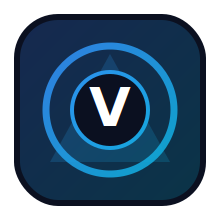

# Velktharion

<p align="center">
  
</p>


[](https://ko-fi.com/smouj013_dev)

<p align="center">
  <a href="./README.md"></a>
  <a href="./README.es.md"></a>
</p>

**Autonomous browser intelligence with persistent strategic memory.**

## Visión
Velktharion es una skill de navegación web autónoma que ejecuta tareas de navegador de forma fiable, conserva contexto de ejecuciones previas y entrega resultados estructurados para automatizaciones posteriores. Está pensada para scraping robusto, ejecución de flujos y operaciones UI repetibles con controles de seguridad.

## Superpoder principal
- ⚡ **State-aware autonomous browsing that learns from every run**

## Estado actual (Febrero 2026)
- 🚧 Fase de ideación y scaffolding robusto
- Próximos hitos:
  - [ ] Finalizar contratos de dominio e interfaces
  - [ ] Publicar un comando CLI mínimo ejecutable
  - [ ] Añadir perfil de modelo local Ollama y estrategia de fallback
  - [ ] Implementar un ejemplo completo end-to-end
  - [ ] Añadir puertas de calidad (lint, typecheck, test)
  - [ ] Publicar arquitectura y runbook operativo

## Arquitectura planeada (stack gratuito/open-source)
- **Lenguaje principal:** Python 3.11+
- **Framework agente:** LangGraph
- **Modelos locales:** Ollama (Llama 3.1, Qwen2.5, DeepSeek-Coder, Mistral)
- **Dependencias clave:** playwright, chromadb, pydantic, httpx, tenacity
- **Modelo de ejecución:** local-first, despliegue self-hosted opcional

## Blueprint de capacidades
- ✅ Navigation planning
- ✅ Session memory graph
- ✅ Resilient retries
- ✅ Structured extraction
- ✅ Action safety policies


## Estructura del proyecto
```text
Velktharion/
├── src/velktharion/
│   ├── core/           # orquestación de dominio y políticas
│   ├── adapters/       # integraciones externas y puentes de herramientas
│   ├── memory/         # estado, recuperación y estrategias de contexto
│   └── cli.py          # interfaz de comandos local para operación
├── docs/
│   ├── IMPLEMENTATION.md
│   ├── ARCHITECTURE.md
│   └── RUNBOOK.md
├── examples/
├── tests/
├── requirements.txt
└── README.md
```

## Inicio rápido
```bash
git clone https://github.com/smouj/Velktharion.git
cd Velktharion
python -m venv .venv
source .venv/bin/activate  # Windows: .venv\Scripts\activate
pip install -r requirements.txt
python -m src.velktharion.cli --help
```

## Documentación
- [Guía de implementación](./docs/IMPLEMENTATION.md)
- [Arquitectura](./docs/ARCHITECTURE.md)
- [Runbook](./docs/RUNBOOK.md)
- [Guía de despliegue](./docs/DEPLOYMENT.md)
- [Proceso de releases](./docs/RELEASE.md)
- [Changelog](./CHANGELOG.md)
- [Contribución](./CONTRIBUTING.md)

## Contribución
Las contribuciones son bienvenidas. Lee **CONTRIBUTING.md** antes de abrir issues o PRs.

## Licencia
MIT © 2026 smouj

---

### Otras skills
Explora el ecosistema completo aquí: **[smouj/smouj](https://github.com/smouj/smouj)**

**Firma:** [@Smouj013](https://x.com/smouj013)
